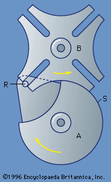

# Geneva Mechanism
## Overview 
A Geneva Mechanism is a gear system that converts constant rotary motion into intermittent rotary motion. It is made up of a driving wheel with one or more pins and a driven wheel called a Geneva wheel with slots that the pins slide into. When the pin enters a slide, it rotates the Geneva wheel by a fixed angle which can be found by dividing 360 by the number of slides on the wheel, then disengages while the wheel remains stationary. This mechanism is commonly used in film projectors to advance film one frame at a time between periods of rest. The design ensures precise frameworks and reliable stopping positions. Geneva mechanisms are valued in applications that need accurate, repeated rotational positioning.

For a more detailed look at the mechanism click [here.](https://ecommons.cornell.edu/server/api/core/bitstreams/4686812a-7d97-47e4-8f46-1fb663eb41fd/content) This really helped me with the designing portion of the project.

